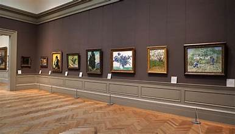
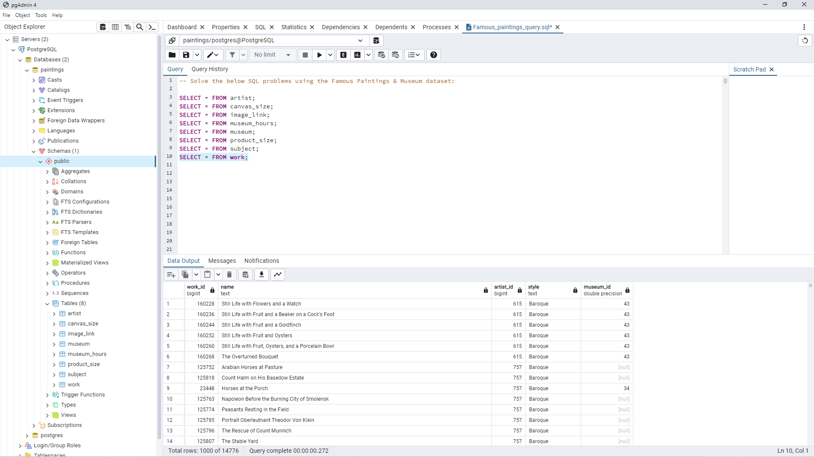
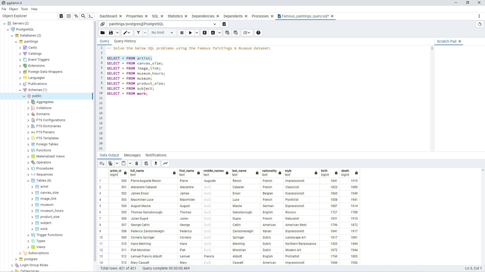
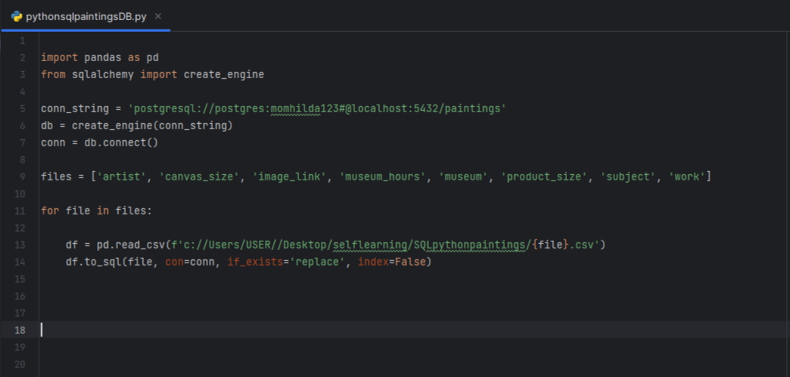
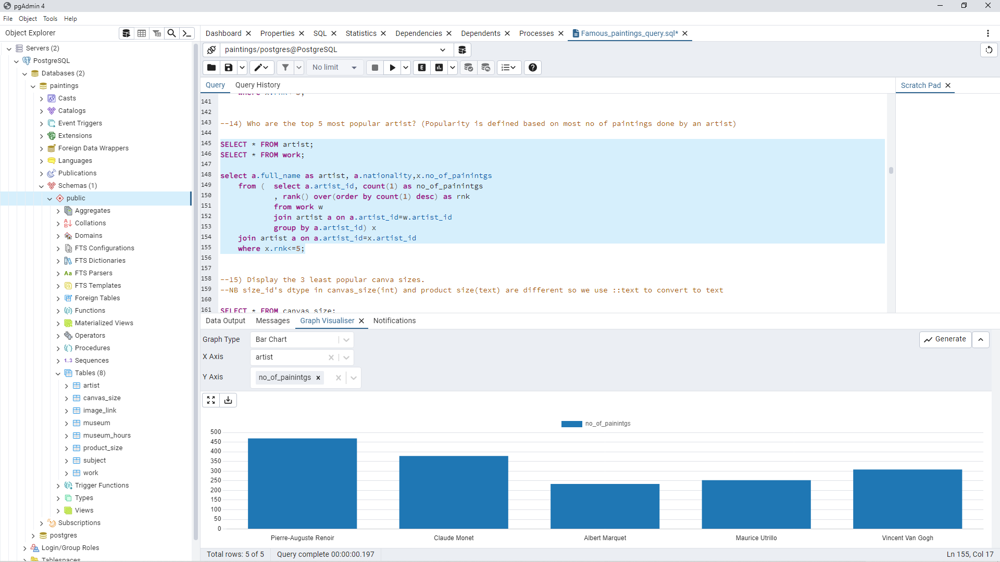
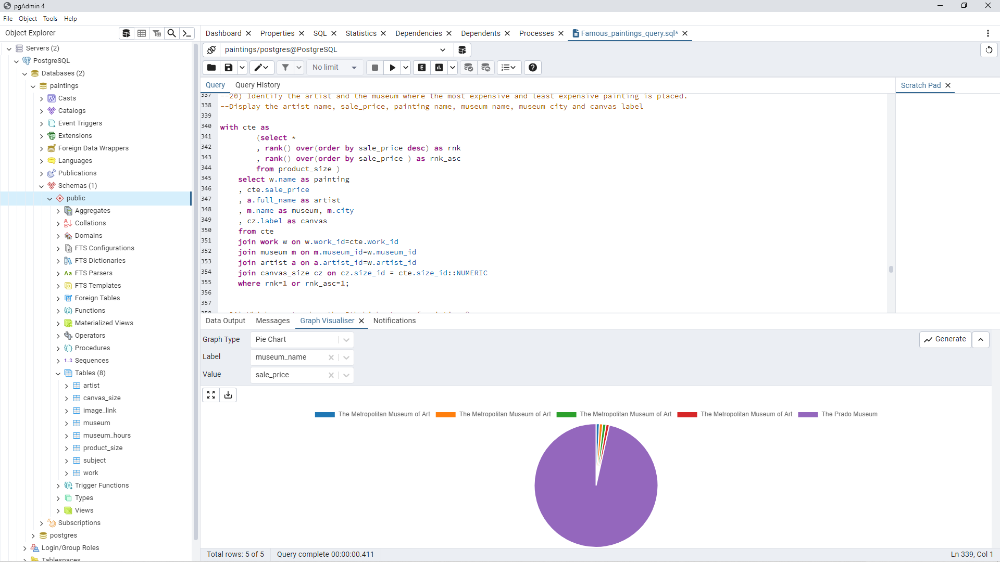

# Musuems_Paintings_data_analysis

## Introduction

The following document outlines the process and outcomes of a project focused on creating a database for paintings ,artists and museums using SQL then to analyze data. The project involved downloading the famous paintings dataset from Kaggle and then upload data from CSV files to a PostgreSQL database tables using a simple Python script and executing various queries to extract meaningful insights from the dataset.l then used SQL queries to answer over 20 problems related to the famous paintings dataset.

## Data Collection and Database Creation:
l downloaded the the famous paintings dataset from Kaggle(https://www.kaggle.com/datasets/mexwell/famous-paintings) and it consisted of 8 CSV files namely :

- ***artist*** :This file have all information about 421 artists from their name to the day they died ,
- ***canvas_size*** :This file consist of 200 canvas sizes that the artists could have used to paint their paintings,
- ***image_link*** : All links to the paintings are in this file,
- ***museum_hours*** : This has information about the days  when the museums are open and the timings when the museums open and close,
- ***museum*** : Information about 57 museums are in this file,from the location to their website,
- ***product_size*** : This file has 110347 products or paintings,showing their sizes and prices,
- ***subject*** :This file shows the subject of the paintings painted by the artists eg potraits,still life,flowers etc,
- ***work*** : This shows the paintings name,their artists and the museum you can find them.

  

## Data Uploading to SQL:
Instead of manually creating the tables and importing data for each of the tables l uploaded the csv files into python using a Python script then from python the dataframe was connected to  a PostgreSQL database by the name paintings.
Python's SQLAlchemy and Pandas library was utilized to connect to the PostgreSQL database and upload the collected data.No data preprocessing techniques were applied to clean or transform the raw data before uploading it to SQL.
The uploaded data was validated to ensure data integrity and consistency within the database.Below are examples of two tables that were successfully connected :

## Work Table

The work table after connection  has  14776 rows and 5 columns(work_id , name, artist_id, style, museum_id) and a few rows can be seen from the above picture.

## Artist Table

The artist 421 artists (rows) and 9 columns(artist_id , full_name, first_name, middle_names,last_name, nationality, style, birth, death) and a few rows can be seen from the above picture.

## Python script used for upload
As shown below in the picture the first 5 lines of code connect python to PostgreSQL database.To load from CSV to python pandas module is used and then to connect to PostgreSQL database ,SQLAlchemy module is used.

## SQL Query Execution:

l answered a series of SQL queries which were designed to extract relevant information and perform analysis on the paintings and museums dataset.
The queries answered these questions below and the answers to the queries can be found in this [SQL file](https://github.com/maudrues/Musuems_Paintings_data_analysis/blob/main/Famous_paintings_query.sql):

1) Fetch all the paintings which are not displayed on any museums?

2) Are there museuems without any paintings?

3) How many paintings have an asking price of more than their regular price? 

4) Identify the paintings whose asking price is less than 50% of its regular price

5) Which canva size costs the most?

6) Delete duplicate records from work, product_size, subject and image_link tables

7) Identify the museums with invalid city information in the given dataset

8) Museum_Hours table has 1 invalid entry. Identify it and remove it.

9) Fetch the top 10 most famous painting subject

10) Identify the museums which are open on both Sunday and Monday. Display museum name, city.

11) How many museums are open every single day?

12) Which are the top 5 most popular museum? (Popularity is defined based on most no of paintings in a museum)

13) Who are the top 5 most popular artist? (Popularity is defined based on most no of paintings done by an artist)

14) Display the 3 least popular canva sizes

15) Which museum is open for the longest during a day. Dispay museum name, state and hours open and which day?

16) Which museum has the most no of most popular painting style?

17) Identify the artists whose paintings are displayed in multiple countries

18) Display the country and the city with most no of museums. Output 2 seperate columns to mention the city and country. If there are multiple value, seperate them with comma.

19) Identify the artist and the museum where the most expensive and least expensive painting is placed. Display the artist name, sale_price, painting name, museum name, museum city and canvas label

20) Which country has the 5th highest no of paintings?

21) Which are the 3 most popular and 3 least popular painting styles?

22) Which artist has the most no of Portraits paintings outside USA?. Display artist name, no of paintings and the artist nationality.

## Data Visualization and Reporting:
Results from the SQL queries were visualized using the built in Graph Visualiser function  in PostgreSQL database to create insightful charts and graphs.Exaples can be seen below :

From **query 14** we can see the top 5 artists with the most number of paintings,with Pierre_Auguste Renoir has the most number of paintings as shown on the bar chart.

From **query 20** we can see that The Prado Museum has the most expensive painting as shown in the pie chart.

## Findings:

- Painting Distribution by Artists:
The analysis revealed a diverse distribution of paintings across artists, with some artists having a higher number of works compared to others.
For example as shown above in **query 14**,Pierre_Auguste Renoir has the most number of paintings

- Museum Collections:
The total number of paintings in each museum varied significantly, indicating differences in collection size and focus.

- Painting Genres and Trends:
Analysis of painting genres highlighted trends in artistic preferences and historical periods.The most popular painting style being "Realism", "Post-Impressionism" and "Impressionism".The least popular style being "Japanese Art", "Art Nouveau" and "Avant-Garde"
(check **query 22**)

## Recommendations:

Based on the findings of the analysis, the following recommendations are proposed:

- Curatorial Decisions:
Museums can use insights from the analysis to inform curatorial decisions, such as planning exhibitions, acquiring new artworks, or diversifying their collections.
- Art Market Insights:
Art dealers and collectors can leverage the data to gain insights into market trends, identify valuable artworks, and make informed investment decisions.
- Educational Resources:
Researchers, educators, and students can utilize the database as a valuable resource for studying art history, analyzing artistic trends, and conducting academic research.

## Project Evaluation and Future Considerations:
The project's success was evaluated based on the accuracy, efficiency, and relevance of the extracted insights.
Areas for improvement, such as optimizing query performance, enhancing data quality, and expanding the scope of analysis, were identified for future iterations of the project.
The insights to be visualized using proper visualisation tools like power BI or Tableau for clear picture and insight.

## Conclusion:

The paintings and museums database project successfully demonstrated the utility of Python and SQL for collecting, managing, and analyzing art-related data. The findings and insights derived from the analysis provide valuable information for various stakeholders in the art industry, from museum curators and art dealers to researchers and educators. Moving forward, the database can be further expanded, refined, and utilized to enhance our understanding of art history and facilitate informed decision-making in the field of visual arts.
 By leveraging these tools and techniques, valuable insights were extracted, providing a deeper understanding of the relationships between paintings, artists, and museums. Moving forward, continued refinement and expansion of the project will also further enrich its utility and impact in the domain of art history and museum management.At the end l can say this was  comprehensive report summarizing the findings, methodology, and recommendations  to communicate the project's outcomes effectively.
